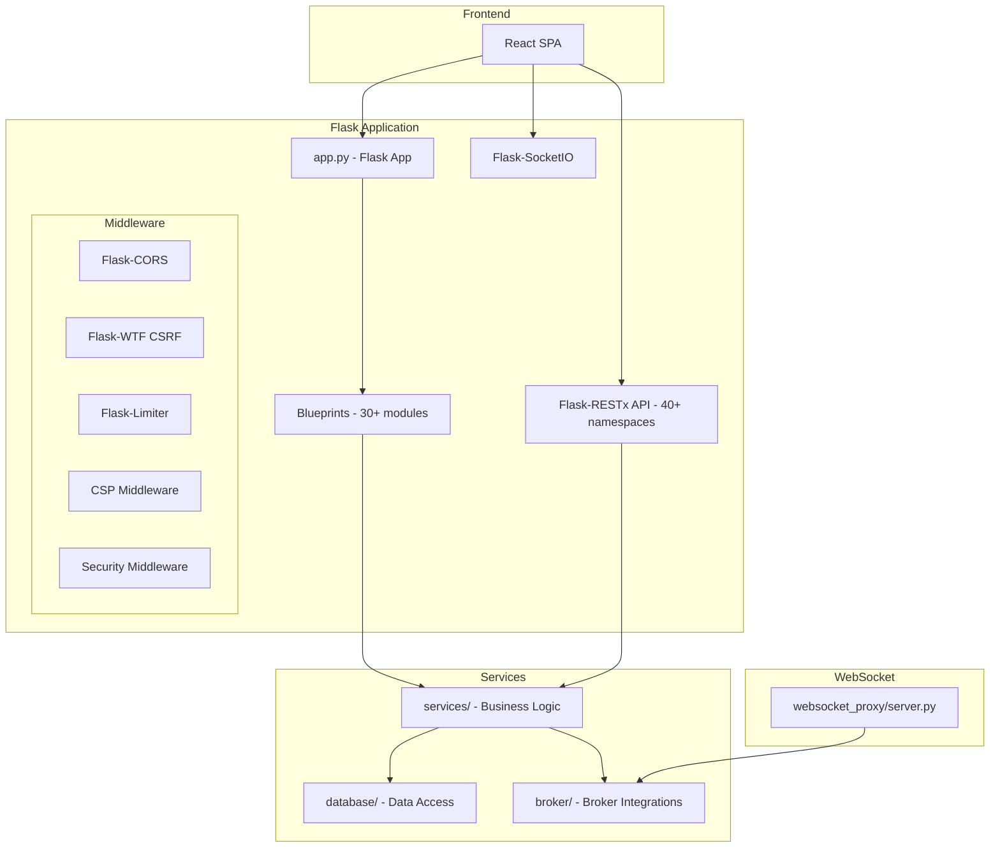
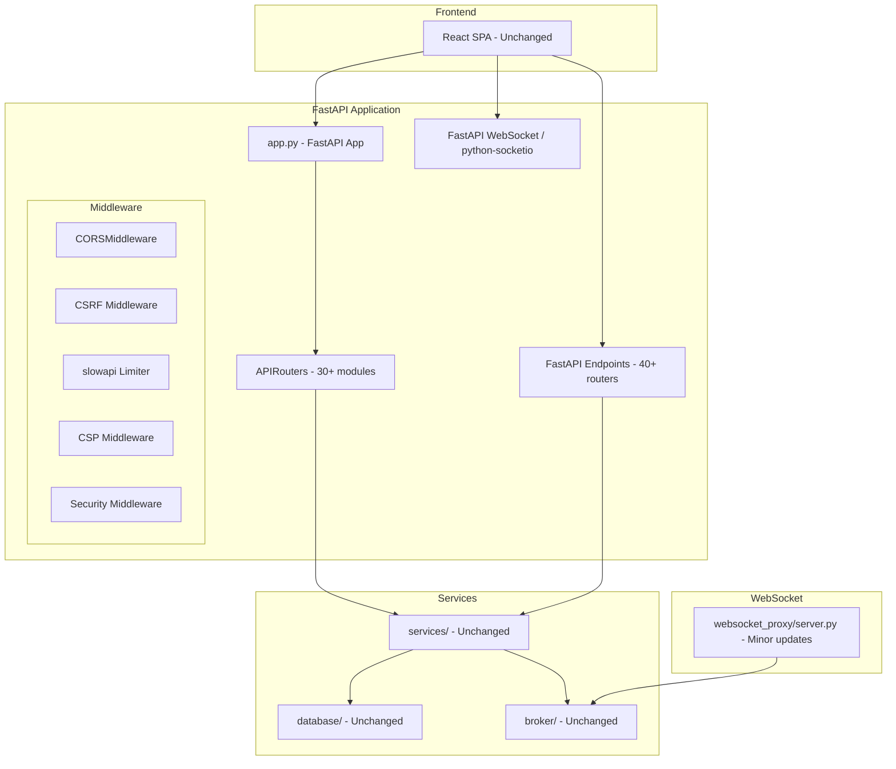

# Design Document: RealAlgo Migration

## Overview

This design document outlines the technical approach for migrating the OpenAlgo trading platform from Flask to FastAPI and rebranding from "OpenAlgo" to "RealAlgo". The migration follows a phased approach to ensure testability, rollback capability, and zero downtime.

The existing application consists of:
- **Flask application** (`app.py`) with 30+ blueprints
- **Flask-RESTx API** with 40+ namespaces for trading operations
- **Flask-SocketIO** for real-time WebSocket communication
- **React frontend** that consumes the backend APIs
- **Service layer** containing business logic (to remain unchanged)
- **Database layer** using SQLAlchemy (to remain unchanged)

## Architecture

### Current Architecture (Flask)



### Target Architecture (FastAPI)



## Components and Interfaces

### Component 1: FastAPI Application Core

**Purpose**: Replace Flask application initialization and configuration

**Location**: `app.py` (replace existing)

**Interface**:
```python
from fastapi import FastAPI, Request, Response
from fastapi.middleware.cors import CORSMiddleware
from contextlib import asynccontextmanager

@asynccontextmanager
async def lifespan(app: FastAPI):
    # Startup: Initialize databases, schedulers, caches
    await setup_environment()
    yield
    # Shutdown: Cleanup resources
    await cleanup_resources()

app = FastAPI(
    title="RealAlgo API",
    version="1.0",
    lifespan=lifespan
)

# Middleware registration order matters
app.add_middleware(SecurityMiddleware)
app.add_middleware(CSPMiddleware)
app.add_middleware(CORSMiddleware, **get_cors_config())
app.add_middleware(SessionMiddleware, secret_key=SECRET_KEY)
```

**Key Mappings**:
| Flask | FastAPI |
|-------|---------|
| `Flask(__name__)` | `FastAPI()` |
| `app.secret_key` | `SessionMiddleware(secret_key=...)` |
| `app.config.update()` | Environment variables / Settings class |
| `@app.before_request` | Middleware or Dependencies |
| `@app.after_request` | Middleware |
| `@app.errorhandler(code)` | `@app.exception_handler(Exception)` |

### Component 2: Router Migration (Blueprints → APIRouters)

**Purpose**: Convert Flask blueprints to FastAPI routers

**Pattern**:
```python
# Flask Blueprint (before)
from flask import Blueprint, session, redirect, jsonify
auth_bp = Blueprint("auth", __name__, url_prefix="/auth")

@auth_bp.route("/login", methods=["GET", "POST"])
@limiter.limit("5 per minute")
def login():
    if request.method == "POST":
        # handle login
        return jsonify({"status": "success"})
    return redirect("/login")

# FastAPI Router (after)
from fastapi import APIRouter, Depends, Request
from fastapi.responses import JSONResponse, RedirectResponse

auth_router = APIRouter(prefix="/auth", tags=["auth"])

@auth_router.api_route("/login", methods=["GET", "POST"])
@limiter.limit("5/minute")
async def login(request: Request, session: Session = Depends(get_session)):
    if request.method == "POST":
        form = await request.form()
        # handle login
        return JSONResponse({"status": "success"})
    return RedirectResponse("/login")
```

**Blueprint to Router Mapping**:
| Blueprint File | Router File | URL Prefix |
|---------------|-------------|------------|
| `blueprints/auth.py` | `blueprints/auth.py` | `/auth` |
| `blueprints/dashboard.py` | `blueprints/dashboard.py` | `/` |
| `blueprints/orders.py` | `blueprints/orders.py` | `/orders` |
| ... (30+ total) | ... | ... |

### Component 3: REST API Migration (Flask-RESTx → FastAPI)

**Purpose**: Convert Flask-RESTx namespaces to FastAPI routers with Pydantic models

**Pattern**:
```python
# Flask-RESTx (before)
from flask_restx import Namespace, Resource, fields

api = Namespace("place_order", description="Place Order API")

order_model = api.model("Order", {
    "apikey": fields.String(required=True),
    "symbol": fields.String(required=True),
    "exchange": fields.String(required=True),
    "action": fields.String(required=True),
    "quantity": fields.Integer(required=True)
})

@api.route("/", strict_slashes=False)
class PlaceOrder(Resource):
    @limiter.limit("10 per second")
    def post(self):
        data = request.json
        success, response, status = place_order(data, data.get("apikey"))
        return make_response(jsonify(response), status)

# FastAPI (after)
from fastapi import APIRouter, Depends
from pydantic import BaseModel

router = APIRouter(prefix="/placeorder", tags=["orders"])

class OrderRequest(BaseModel):
    apikey: str
    symbol: str
    exchange: str
    action: str
    quantity: int

class OrderResponse(BaseModel):
    status: str
    message: str
    orderid: str | None = None

@router.post("/", response_model=OrderResponse)
@limiter.limit("10/second")
async def place_order_endpoint(order: OrderRequest):
    success, response, status = place_order(order.model_dump(), order.apikey)
    return JSONResponse(content=response, status_code=status)
```

### Component 4: Session Management

**Purpose**: Replace Flask session with FastAPI-compatible session handling

**Design**:
```python
from starlette.middleware.sessions import SessionMiddleware
from fastapi import Depends, Request

# Session dependency
async def get_session(request: Request) -> dict:
    return request.session

# Session validity check dependency
async def check_session_validity(
    request: Request,
    session: dict = Depends(get_session)
) -> dict:
    if not is_session_valid(session):
        revoke_user_tokens(session)
        request.session.clear()
        raise HTTPException(status_code=401, detail="Session expired")
    return session

# Protected route usage
@router.get("/dashboard")
async def dashboard(session: dict = Depends(check_session_validity)):
    return {"user": session.get("user")}
```

### Component 5: Rate Limiting

**Purpose**: Replace Flask-Limiter with slowapi

**Design**:
```python
# limiter.py (updated)
from slowapi import Limiter
from slowapi.util import get_remote_address

limiter = Limiter(key_func=get_remote_address)

# Usage in routes
from limiter import limiter

@router.post("/login")
@limiter.limit("5/minute")
@limiter.limit("25/hour")
async def login(request: Request):
    ...
```

### Component 6: CORS Configuration

**Purpose**: Replace Flask-CORS with FastAPI CORSMiddleware

**Design**:
```python
# cors.py (updated)
from fastapi.middleware.cors import CORSMiddleware

def get_cors_config() -> dict:
    if not os.getenv("CORS_ENABLED", "FALSE").upper() == "TRUE":
        return {}
    
    return {
        "allow_origins": os.getenv("CORS_ALLOWED_ORIGINS", "").split(","),
        "allow_methods": os.getenv("CORS_ALLOWED_METHODS", "GET,POST").split(","),
        "allow_headers": os.getenv("CORS_ALLOWED_HEADERS", "*").split(","),
        "allow_credentials": os.getenv("CORS_ALLOW_CREDENTIALS", "FALSE").upper() == "TRUE",
        "max_age": int(os.getenv("CORS_MAX_AGE", "600"))
    }

# In app.py
app.add_middleware(CORSMiddleware, **get_cors_config())
```

### Component 7: CSRF Protection

**Purpose**: Implement CSRF protection for FastAPI

**Design**:
```python
# csrf.py (new)
from fastapi import Request, HTTPException
from starlette.middleware.base import BaseHTTPMiddleware
import secrets

class CSRFMiddleware(BaseHTTPMiddleware):
    def __init__(self, app, secret_key: str, exempt_paths: list[str] = None):
        super().__init__(app)
        self.secret_key = secret_key
        self.exempt_paths = exempt_paths or ["/api/v1/"]
    
    async def dispatch(self, request: Request, call_next):
        # Skip CSRF for exempt paths (API endpoints use API key auth)
        if any(request.url.path.startswith(p) for p in self.exempt_paths):
            return await call_next(request)
        
        # Skip for safe methods
        if request.method in ("GET", "HEAD", "OPTIONS"):
            return await call_next(request)
        
        # Validate CSRF token
        token = request.headers.get("X-CSRF-Token") or \
                (await request.form()).get("csrf_token")
        session_token = request.session.get("csrf_token")
        
        if not token or not secrets.compare_digest(token, session_token or ""):
            raise HTTPException(status_code=400, detail="CSRF validation failed")
        
        return await call_next(request)

# CSRF token endpoint
@router.get("/csrf-token")
async def get_csrf_token(request: Request):
    token = secrets.token_urlsafe(32)
    request.session["csrf_token"] = token
    return {"csrf_token": token}
```

### Component 8: WebSocket Migration

**Purpose**: Migrate Flask-SocketIO to FastAPI WebSocket or python-socketio with ASGI

**Option A: python-socketio with ASGI (Recommended for compatibility)**
```python
# extensions.py (updated)
import socketio

sio = socketio.AsyncServer(
    async_mode='asgi',
    cors_allowed_origins='*',
    ping_timeout=10,
    ping_interval=5
)

socket_app = socketio.ASGIApp(sio)

# In app.py
app.mount("/socket.io", socket_app)

# Event handlers remain similar
@sio.event
async def connect(sid, environ):
    logger.info(f"Client connected: {sid}")

@sio.event
async def disconnect(sid):
    logger.info(f"Client disconnected: {sid}")
```

**Option B: Native FastAPI WebSocket**
```python
from fastapi import WebSocket, WebSocketDisconnect

@app.websocket("/ws")
async def websocket_endpoint(websocket: WebSocket):
    await websocket.accept()
    try:
        while True:
            data = await websocket.receive_json()
            # Process message
            await websocket.send_json({"status": "ok"})
    except WebSocketDisconnect:
        logger.info("Client disconnected")
```

### Component 9: Security Middleware

**Purpose**: Port security middleware to FastAPI

**Design**:
```python
# utils/security_middleware.py (updated)
from starlette.middleware.base import BaseHTTPMiddleware
from fastapi import Request
from starlette.responses import PlainTextResponse

class SecurityMiddleware(BaseHTTPMiddleware):
    async def dispatch(self, request: Request, call_next):
        client_ip = get_real_ip(request)
        
        if IPBan.is_ip_banned(client_ip):
            logger.warning(f"Blocked banned IP: {client_ip}")
            return PlainTextResponse(
                "Access Denied: Your IP has been banned",
                status_code=403
            )
        
        return await call_next(request)
```

### Component 10: CSP Middleware

**Purpose**: Port Content Security Policy middleware to FastAPI

**Design**:
```python
# csp.py (updated)
from starlette.middleware.base import BaseHTTPMiddleware

class CSPMiddleware(BaseHTTPMiddleware):
    async def dispatch(self, request: Request, call_next):
        response = await call_next(request)
        
        csp_config = get_csp_config()
        if csp_config:
            csp_header = build_csp_header(csp_config)
            header_type = "Content-Security-Policy"
            if os.getenv("CSP_REPORT_ONLY", "FALSE").upper() == "TRUE":
                header_type = "Content-Security-Policy-Report-Only"
            response.headers[header_type] = csp_header
        
        # Add other security headers
        for name, value in get_security_headers().items():
            response.headers[name] = value
        
        return response
```

## Data Models

### Pydantic Models for API Requests/Responses

```python
# restx_api/schemas.py (new unified schemas)
from pydantic import BaseModel, Field
from typing import Optional, List
from enum import Enum

class ActionType(str, Enum):
    BUY = "BUY"
    SELL = "SELL"

class ProductType(str, Enum):
    CNC = "CNC"
    MIS = "MIS"
    NRML = "NRML"

class OrderType(str, Enum):
    MARKET = "MARKET"
    LIMIT = "LIMIT"
    SL = "SL"
    SL_M = "SL-M"

# Request Models
class PlaceOrderRequest(BaseModel):
    apikey: str
    symbol: str
    exchange: str
    action: ActionType
    quantity: int
    product: ProductType = ProductType.MIS
    pricetype: OrderType = OrderType.MARKET
    price: float = 0.0
    trigger_price: float = 0.0
    disclosed_quantity: int = 0
    strategy: Optional[str] = None

class ModifyOrderRequest(BaseModel):
    apikey: str
    orderid: str
    quantity: Optional[int] = None
    price: Optional[float] = None
    trigger_price: Optional[float] = None

class CancelOrderRequest(BaseModel):
    apikey: str
    orderid: str

# Response Models
class BaseResponse(BaseModel):
    status: str
    message: Optional[str] = None

class OrderResponse(BaseResponse):
    orderid: Optional[str] = None

class FundsResponse(BaseResponse):
    data: Optional[dict] = None

class PositionItem(BaseModel):
    symbol: str
    exchange: str
    product: str
    quantity: int
    average_price: float
    ltp: float
    pnl: float

class PositionsResponse(BaseResponse):
    data: Optional[List[PositionItem]] = None
```

## Correctness Properties

*A property is a characteristic or behavior that should hold true across all valid executions of a system—essentially, a formal statement about what the system should do. Properties serve as the bridge between human-readable specifications and machine-verifiable correctness guarantees.*


### Property 1: Rebranding Completeness - Python Files
*For any* Python file in the codebase after rebranding, there SHALL be no string literals containing "OpenAlgo" or "openalgo" (case-insensitive match for brand name).
**Validates: Requirements 1.1, 1.2**

### Property 2: Rebranding Completeness - Configuration and Documentation
*For any* configuration file (.env, .yaml, .json) or documentation file (.md, .txt) after rebranding, there SHALL be no references to "OpenAlgo" or "openalgo".
**Validates: Requirements 1.3, 1.4**

### Property 3: Frontend Rebranding Completeness
*For any* frontend source file (.tsx, .ts, .jsx, .js, .html, .css) after rebranding, there SHALL be no references to "OpenAlgo" or "openalgo".
**Validates: Requirements 2.1, 2.3**

### Property 4: Blueprint to Router URL Preservation
*For any* Flask blueprint with URL prefix P, the corresponding FastAPI router SHALL have the same URL prefix P, and *for any* route R registered on that blueprint, the router SHALL have an equivalent route with the same path pattern and HTTP methods.
**Validates: Requirements 4.1, 4.2, 4.3**

### Property 5: REST API Contract Preservation
*For any* Flask-RESTx endpoint with path P, request schema S_req, and response schema S_res, the corresponding FastAPI endpoint SHALL have path P, accept requests matching S_req, and return responses matching S_res.
**Validates: Requirements 5.1, 5.2, 5.3, 9.1, 9.2, 9.3**

### Property 6: API Response Equivalence
*For any* valid API request R sent to both Flask and FastAPI versions, the response status code and JSON body structure SHALL be identical (excluding timestamps and dynamic IDs).
**Validates: Requirements 5.3, 9.3, 9.7**

### Property 7: Rate Limit Equivalence
*For any* rate-limited endpoint, the rate limit value in FastAPI (slowapi) SHALL match the rate limit value in Flask (Flask-Limiter).
**Validates: Requirements 5.5, 7.2**

### Property 8: Session Cookie Configuration Equivalence
*For any* session cookie configuration parameter (HTTPONLY, SAMESITE, SECURE, NAME), the FastAPI configuration SHALL match the Flask configuration.
**Validates: Requirements 3.2, 7.3**

### Property 9: CSRF Token Round-Trip
*For any* CSRF token T generated by the /auth/csrf-token endpoint, submitting a form with token T SHALL be accepted, and submitting with an invalid token SHALL be rejected with status 400.
**Validates: Requirements 3.3, 7.4**

### Property 10: WebSocket Message Format Preservation
*For any* WebSocket event E with payload P in Flask-SocketIO, the equivalent event in FastAPI WebSocket SHALL have the same event name E and payload structure P.
**Validates: Requirements 6.2, 6.6**

### Property 11: Service Layer Immutability
*For any* file in services/, database/, broker/, or sandbox/ directories, the file content SHALL be unchanged after migration except for import statement modifications required for FastAPI compatibility.
**Validates: Requirements 10.1, 10.2, 10.3, 10.4**

### Property 12: Error Response Format Equivalence
*For any* error condition (400, 401, 403, 404, 429, 500), the error response JSON structure from FastAPI SHALL match the Flask error response structure.
**Validates: Requirements 3.5, 8.5, 9.4**

### Property 13: Directory Structure Preservation
*For any* directory D existing before migration, D SHALL exist after migration with the same relative path, and no new top-level directories SHALL be created.
**Validates: Requirements 12.1, 12.2, 12.3, 12.4, 12.5, 12.6**

### Property 14: Middleware Header Equivalence
*For any* HTTP response, the security headers (CSP, Referrer-Policy, Permissions-Policy) SHALL be identical between Flask and FastAPI versions.
**Validates: Requirements 8.1, 8.3**

### Property 15: Authentication Flow Equivalence
*For any* authentication flow (login, logout, password reset, TOTP verification), the sequence of API calls and responses SHALL produce identical session state in both Flask and FastAPI versions.
**Validates: Requirements 4.6, 6.5**

## Error Handling

### HTTP Error Responses

| Error Code | Condition | Response Format |
|------------|-----------|-----------------|
| 400 | CSRF validation failed | `{"error": "CSRF validation failed", "message": "..."}` |
| 401 | Session expired | `{"status": "error", "error": "session_expired", "message": "..."}` |
| 403 | IP banned | `{"error": "Access Denied"}` |
| 404 | Route not found | Serve React app (React Router handles 404) |
| 429 | Rate limit exceeded | `{"status": "error", "message": "Rate limit exceeded...", "retry_after": 60}` |
| 500 | Server error | Redirect to `/error` |

### Exception Handlers

```python
@app.exception_handler(HTTPException)
async def http_exception_handler(request: Request, exc: HTTPException):
    if exc.status_code == 404:
        return serve_react_app()
    return JSONResponse(
        status_code=exc.status_code,
        content={"error": exc.detail}
    )

@app.exception_handler(RequestValidationError)
async def validation_exception_handler(request: Request, exc: RequestValidationError):
    return JSONResponse(
        status_code=400,
        content={"status": "error", "message": str(exc)}
    )

@app.exception_handler(RateLimitExceeded)
async def rate_limit_handler(request: Request, exc: RateLimitExceeded):
    if request.url.path.startswith("/api/"):
        return JSONResponse(
            status_code=429,
            content={
                "status": "error",
                "message": "Rate limit exceeded. Please slow down your requests.",
                "retry_after": 60
            }
        )
    return RedirectResponse("/rate-limited")
```

## Testing Strategy

### Dual Testing Approach

The migration requires both unit tests and property-based tests to ensure correctness:

1. **Unit Tests**: Verify specific examples, edge cases, and error conditions
2. **Property Tests**: Verify universal properties across all inputs using hypothesis

### Property-Based Testing Configuration

- **Library**: hypothesis (Python property-based testing)
- **Minimum iterations**: 100 per property test
- **Tag format**: `@pytest.mark.property("Feature: realalgo-migration, Property N: description")`

### Test Categories

#### Phase 1: Rebranding Tests
```python
# test/test_rebranding.py
from hypothesis import given, strategies as st
import os
import re

@pytest.mark.property("Feature: realalgo-migration, Property 1: Rebranding Completeness - Python Files")
def test_no_openalgo_in_python_files():
    """Property 1: No OpenAlgo references in Python files after rebranding"""
    for root, dirs, files in os.walk("."):
        # Skip virtual environments and cache
        dirs[:] = [d for d in dirs if d not in ['venv', '__pycache__', '.git', 'node_modules']]
        for file in files:
            if file.endswith('.py'):
                filepath = os.path.join(root, file)
                with open(filepath, 'r') as f:
                    content = f.read()
                    # Check for brand name (not package imports which may be renamed separately)
                    assert 'OpenAlgo' not in content or 'RealAlgo' in content, f"Found OpenAlgo in {filepath}"
```

#### Phase 2: API Contract Tests
```python
# test/test_api_contracts.py
from hypothesis import given, strategies as st
import httpx

@pytest.mark.property("Feature: realalgo-migration, Property 5: REST API Contract Preservation")
@given(st.sampled_from(API_ENDPOINTS))
def test_api_endpoint_exists(endpoint):
    """Property 5: All API endpoints exist with same paths"""
    flask_response = httpx.options(f"{FLASK_URL}{endpoint}")
    fastapi_response = httpx.options(f"{FASTAPI_URL}{endpoint}")
    assert flask_response.status_code == fastapi_response.status_code

@pytest.mark.property("Feature: realalgo-migration, Property 6: API Response Equivalence")
@given(st.fixed_dictionaries({
    'symbol': st.text(min_size=1, max_size=20),
    'exchange': st.sampled_from(['NSE', 'BSE', 'NFO', 'MCX']),
}))
def test_quotes_response_equivalence(params):
    """Property 6: Quote responses match between Flask and FastAPI"""
    flask_resp = get_flask_response('/api/v1/quotes', params)
    fastapi_resp = get_fastapi_response('/api/v1/quotes', params)
    assert_response_structure_matches(flask_resp, fastapi_resp)
```

#### Phase 3: Session and Auth Tests
```python
# test/test_session.py
@pytest.mark.property("Feature: realalgo-migration, Property 9: CSRF Token Round-Trip")
@given(st.text(min_size=1))
def test_csrf_token_roundtrip(form_data):
    """Property 9: CSRF tokens work correctly"""
    # Get token
    token_resp = client.get('/auth/csrf-token')
    token = token_resp.json()['csrf_token']
    
    # Submit with valid token - should succeed
    valid_resp = client.post('/some-form', 
        data={'csrf_token': token, 'data': form_data},
        headers={'X-CSRF-Token': token}
    )
    assert valid_resp.status_code != 400 or 'CSRF' not in valid_resp.text
    
    # Submit with invalid token - should fail
    invalid_resp = client.post('/some-form',
        data={'csrf_token': 'invalid', 'data': form_data}
    )
    assert invalid_resp.status_code == 400
```

#### Phase 4: WebSocket Tests
```python
# test/test_websocket.py
@pytest.mark.property("Feature: realalgo-migration, Property 10: WebSocket Message Format Preservation")
@given(st.fixed_dictionaries({
    'symbol': st.text(min_size=1, max_size=20),
    'exchange': st.sampled_from(['NSE', 'BSE']),
    'mode': st.sampled_from(['LTP', 'Quote', 'Depth'])
}))
async def test_websocket_message_format(subscription):
    """Property 10: WebSocket messages have same format"""
    flask_msg = await get_flask_ws_message(subscription)
    fastapi_msg = await get_fastapi_ws_message(subscription)
    assert_message_structure_matches(flask_msg, fastapi_msg)
```

### Integration Test Suite

```python
# test/test_integration.py
class TestFullMigration:
    """Integration tests for complete migration validation"""
    
    def test_frontend_login_flow(self):
        """Verify React frontend can complete login flow"""
        # 1. Get CSRF token
        # 2. Submit login form
        # 3. Verify session established
        # 4. Access protected route
        pass
    
    def test_api_order_flow(self):
        """Verify API order placement works identically"""
        # 1. Authenticate with API key
        # 2. Place order
        # 3. Check order status
        # 4. Cancel order
        pass
    
    def test_websocket_subscription_flow(self):
        """Verify WebSocket data flow works identically"""
        # 1. Connect WebSocket
        # 2. Authenticate
        # 3. Subscribe to symbol
        # 4. Receive market data
        pass
```

### Rollback Testing

Each phase includes rollback verification:
```python
def test_phase_rollback():
    """Verify rollback restores previous state"""
    # 1. Capture current state
    # 2. Apply phase changes
    # 3. Run phase tests
    # 4. Execute rollback
    # 5. Verify original state restored
    pass
```
